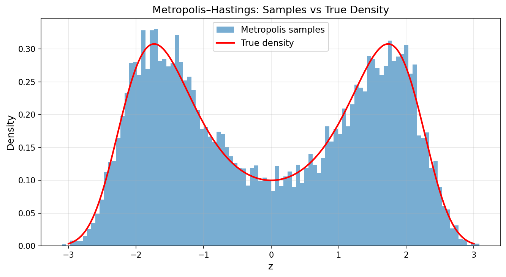
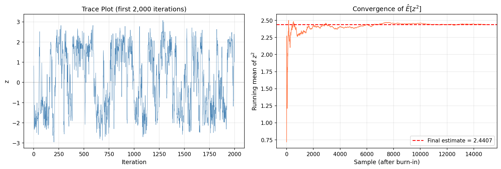

# Sampling from a Distribution

A comprehensive collection of **sampling algorithms** for drawing samples from probability distributions — from basic Monte Carlo to gradient-based MCMC. Each method is implemented in Python (Jupyter notebooks), with a companion **LaTeX document** providing the theory, algorithms, experimental results, and discussion.

---

## Overview

Sampling from a target distribution $p(x)$ is a fundamental problem in Bayesian inference, statistical physics, and generative modelling. This repository implements and compares **seven** sampling methods, progressing from simple to advanced:

| # | Method | Type | Key Idea |
|---|--------|------|----------|
| 1 | **Rejection Sampling** | Exact | Accept/reject under an envelope distribution |
| 2 | **Importance Sampling** | Weighted | Reweight samples from a proposal distribution |
| 3 | **Metropolis–Hastings** | MCMC | Random-walk proposals with accept/reject correction |
| 4 | **Gibbs Sampling** | MCMC | One-variable-at-a-time updates from conditional distributions |
| 5 | **Metropolis-within-Gibbs** | MCMC (hybrid) | Gibbs for tractable conditionals + MH for intractable ones |
| 6 | **Ancestral Sampling** | Exact (DAG) | Forward sampling through a Bayesian network |
| 7 | **Langevin Dynamics** | Gradient MCMC | Gradient-guided proposals using the score function |

---

## Example: Metropolis–Hastings on a Bimodal Target

The Metropolis–Hastings algorithm uses a simple random-walk proposal to sample from a **bimodal target density** (mixture of two Gaussians). Below is the histogram of 20,000 MH samples overlaid with the true density — both modes are recovered accurately:

<p align="center">
  
</p>

The trace plot and running mean confirm convergence and good mixing (acceptance rate ≈ 72.6%):

<p align="center">
  
</p>

---

## Repository Structure

```
├── MonteCarloSimulation.tex      # LaTeX document (theory + experiments for all methods)
├── MonteCarloSimulation.ipynb    # Monte Carlo convergence examples (LLN)
├── RejectionSampling.ipynb       # Rejection sampling implementation
├── Sampling.ipynb                # All 7 sampling methods with visualizations
├── DiscreteLatentVariable.ipynb  # Discrete latent variable models
├── ContinuousLatentVariable.ipynb# Continuous latent variable models
├── RejectionSampling.md          # Markdown notes on rejection sampling
├── images/                       # All generated figures (used in LaTeX & README)
│   ├── mh_samples_vs_density.png
│   ├── langevin_energy_and_density.png
│   ├── gibbs_joint_scatter.png
│   ├── ...
└── .gitignore
```

---

## Getting Started

### Requirements

- Python 3.11+
- NumPy, SciPy, Matplotlib

### Run the Notebooks

```bash
pip install numpy scipy matplotlib
jupyter notebook Sampling.ipynb
```

All figures are saved automatically to the `images/` folder when cells are executed.

### Compile the LaTeX Document

```bash
pdflatex MonteCarloSimulation.tex
```

---

## Methods at a Glance

- **Rejection Sampling** — Envelope-based exact sampling from a multimodal target (acceptance rate ≈ 27.7%)
- **Importance Sampling** — Single-Gaussian and mixture proposals; ESS comparison shows mixture is superior
- **Metropolis–Hastings** — Random-walk MCMC recovering a bimodal density with ≈ 72.6% acceptance
- **Gibbs Sampling** — One-variable-at-a-time updates on a correlated bivariate Gaussian (ρ = 0.9)
- **Metropolis-within-Gibbs** — Hybrid sampler for a banana-shaped target with intractable conditionals
- **Ancestral Sampling** — Forward sampling through a linear Gaussian chain (Bayesian network)
- **Langevin Dynamics** — Gradient-guided sampling from a double-well potential; connection to gradient descent and score functions

---

## License

This project is for educational purposes.
